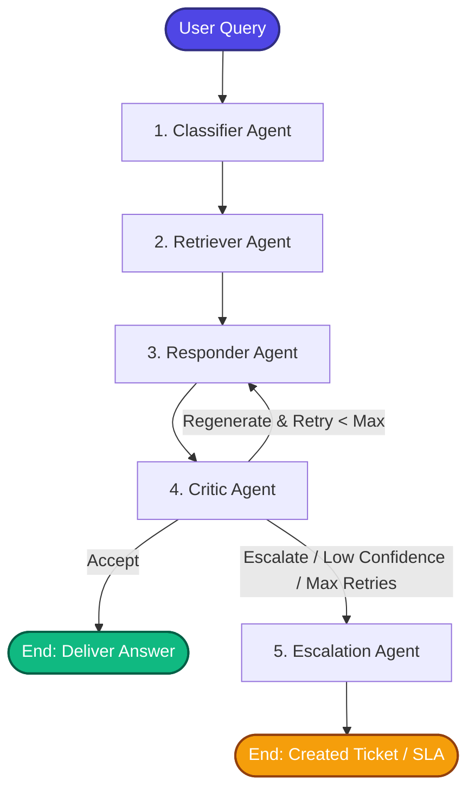
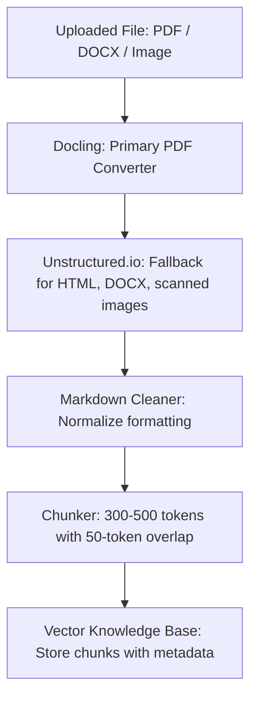
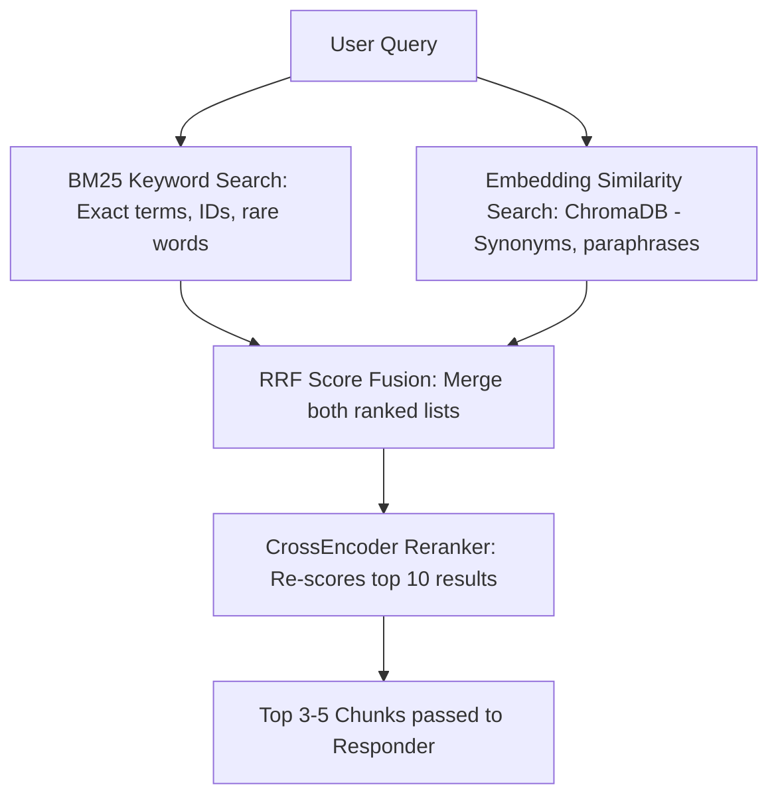

# Multi-Agent Customer Support Router & Responder System

An intelligent, production-ready customer support agent system powered by **LangGraph**, **LangChain**, and **Llama 3** (via Groq Cloud API or locally hosted Ollama). 

This system uses a structured multi-agent architecture to classify incoming user requests, retrieve exact support documentation, generate empathetic responses, evaluate response quality, and automatically escalate issues to human support teams with computed SLAs when necessary.

---

## 🏗️ System Architecture

The workflow is designed as a stateful graph where information flows dynamically between specialized agents. Below is the visualization of the LangGraph execution flow:



---

## 🤖 Meet the Agents

Each node in the support graph represents a decoupled agent acting upon the shared `SupportState`:

1. **Classifier Agent (`agents/classifier.py`)**: 
   - Uses structured outputs to categorize the query into `billing`, `technical`, `delivery`, or `general`.
   - Extracts specific intents (e.g. `double_charge`, `reset_password`, `order_not_arrived`) and key entities (e.g. emails, order IDs).
2. **Retriever Agent (`agents/retriever.py`)**:
   - Performs a multi-level lookup (Exact Match -> Substring Word Overlap -> General Fallback) against a mock knowledge base (`kb.json`).
   - Flags responses as `low_confidence` if they rely on general fallback policies.
3. **Responder Agent (`agents/responder.py`)**:
   - Synthesizes a warm, polite response based strictly on the retrieved context.
   - Dynamically appends critique feedback on retries to self-correct during regeneration loops.
4. **Critic Agent (`agents/critic.py`)**:
   - Evaluates response quality based on **Correctness** (factual grounding), **Completeness** (addresses all points), and **Tone** (empathy and warmth).
   - Routes to `accept`, `regenerate` (triggers a retry), or `escalate` (immediate hand-off).
5. **Escalator Agent (`agents/escalator.py`)**:
   - Processes unresolved issues.
   - Auto-assigns priority (`HIGH`, `MEDIUM`, `LOW`), routes to specialized internal teams, computes SLA resolution windows, and provides the customer a secure Ticket Reference ID.

---

## 📊 SupportState Keys Reference

All agents in the graph communicate and share context through a centralized `SupportState` object (defined in [state.py](file:///c:/Users/USER/Desktop/customer_support/multi_agent_support/state.py)). Below is the complete schema of the state, including the types, the agents that set/update them, and the reason for their inclusion in the workflow:

| Key | Type | Owner / Writer | Reason & Description |
| :--- | :--- | :--- | :--- |
| `user_query` | `str` | *System Entry* | **Immutable Input**: The original user query. Retained in its raw form to act as the primary, unmanipulated source of truth for all downstream agents. |
| `category` | `Optional[str]` | `Classifier` | **Routing Category**: The high-level classification category (e.g., `billing`, `technical`, `delivery`). Helps filter the Knowledge Base and route retrieval queries. |
| `intent` | `Optional[str]` | `Classifier` | **Specific Action Goal**: The detected specific intent (e.g., `double_charge`). Crucial for pulling precise matching support guidelines. |
| `entities` | `Dict[str, Any]` | `Classifier` | **Extracted Variables**: Key entities extracted from the query (like Order IDs, email addresses) needed for issue validation or ticketing payload. |
| `retrieved_context` | `Optional[str]` | `Retriever` | **Knowledge Grounding**: The exact support articles/guidelines fetched from the knowledge base. Provides factual reference for generating answers. |
| `low_confidence` | `bool` | `Retriever` | **Quality Indicator**: Marked `True` if no exact match is found and general fallback is used. Helps decide if the query should bypass standard flow and escalate. |
| `generated_response` | `Optional[str]` | `Responder` | **Candidate Answer**: The draft response generated by the Responder agent. Maintained in state so that the Critic Agent can assess it. |
| `quality_decision` | `Optional[str]` | `Critic` | **Routing Control**: Evaluation outcome (`"accept"`, `"regenerate"`, or `"escalate"`). Acts as the router decision-maker for the graph. |
| `quality_feedback` | `Optional[str]` | `Critic` | **Self-Correction Feedback**: Comments and instructions compiled by the Critic. Passed to the Responder so it knows what to correct during retry loops. |
| `retry_count` | `int` | `Responder` | **Loop Prevention**: Tracks current response regeneration attempts. Prevents infinite feedback loops and triggers escalation if threshold is crossed. |
| `max_retries` | `int` | *System Entry* | **Hard Cap Boundary**: Configurable maximum retries allowed for response correction. Set at initialization to safeguard LLM usage and response time. |
| `escalated` | `bool` | `Escalator` | **System Status**: Flags `True` once a hand-off ticket is created. Alerts external systems that the automated flow is finished. |
| `escalation_reason` | `Optional[str]` | `Escalator` | **Audit/Triage Info**: The exact reason the system escalated (e.g., `Low confidence lookup`, `Max retries exceeded`). Essential for categorizing tickets. |
| `final_answer` | `Optional[str]` | `Critic` / `Escalator` | **Final Output**: The validated, final response or escalation hand-off note delivered to the user at the end of the graph execution. |

---

## 📁 Repository Structure

```text
customer_support/
├── .gitignore                      # Git exclusion rules (e.g., env variables, pycache)
├── README.md                       # Documentation (This file)
└── multi_agent_support/
    ├── main.py                     # Demo entrypoint containing test cases
    ├── graph.py                    # LangGraph configuration and routing logic
    ├── state.py                    # SupportState TypedDict definitions
    ├── requirements.txt            # Python dependencies
    ├── agents/
    │   ├── __init__.py
    │   ├── classifier.py           # Structured classification & entity extraction
    │   ├── retriever.py            # Local knowledge retrieval logic
    │   ├── responder.py            # Empathy-focused response generator
    │   ├── critic.py               # Llama3-based response quality assurance
    │   └── escalator.py            # SLA computation and ticketing logic
    ├── knowledge_base/
    │   └── kb.json                 # Mock support knowledge base (billing, tech, delivery)
    └── utils/
        ├── __init__.py
        └── llm.py                  # Dual LLM provider configuration (Groq / Ollama)
```

---

## 🚀 Setup & Installation

### 1. Prerequisites
- **Python 3.10+** installed.
- (Optional) **Ollama** installed locally for running Llama 3 without API keys, OR a **Groq API Key**.

### 2. Install Dependencies
Create a virtual environment and install the required libraries:

```bash
# Navigate to the project directory
cd customer_support/multi_agent_support

# Create and activate a virtual environment
python -m venv venv
# On Windows (cmd):
venv\Scripts\activate
# On Windows (PowerShell):
.\venv\Scripts\Activate.ps1
# On macOS/Linux:
source venv/bin/activate

# Install requirements
pip install -r requirements.txt
```

### 3. Configure Environment Variables
Create a `.env` file in the `multi_agent_support/` directory:

```bash
# In customer_support/multi_agent_support/.env
GROQ_API_KEY=your_groq_api_key_here
```
> **Note**: If `GROQ_API_KEY` is not present, the system will automatically fall back to using a local Ollama instance running `llama3`. Ensure your local Ollama server is running (`ollama run llama3`) if you are using this mode.

---

## 💻 Running the Demo

Run the main demo script to see the graph execute different queries in real time.

```bash
python main.py
```

### What happens behind the scenes:
The demo feeds a set of sample queries representing various support scenarios:
* **Billing issues** (e.g. *"I was charged twice"*): Routes through classification, fetches billing docs, passes quality checks, and returns a response.
* **Technical queries** (e.g. *"How do I reset my password"*): Staged, retrieved, answered, and accepted.
* **Off-topic or unrecognized queries** (e.g. *"What is your business address?"*): Triggers a general fallback, gets flagged as low-confidence, and routes instantly to the **Escalator Agent** to create a ticket.
* **Complex retries**: Demonstrates the graph self-correcting when the Critic Agent requests a retry.

---

## 🔒 Configuration & Customization
- **Maximum Retries**: Adjust `max_retries` inside the initial state inside [main.py](file:///c:/Users/USER/Desktop/customer_support/multi_agent_support/main.py) to control how many times the Responder tries to satisfy the Critic before escalating.
- **Knowledge Base**: Add new Q&As inside [kb.json](file:///c:/Users/USER/Desktop/customer_support/multi_agent_support/knowledge_base/kb.json) to expand the system's capabilities.
- **Model Adjustments**: Change temperature configurations or underlying models inside [llm.py](file:///c:/Users/USER/Desktop/customer_support/multi_agent_support/utils/llm.py).

---

## 🔮 Future Improvements: Production-Grade Upgrades

The following upgrades document what the system would look like if built for real-world, production-grade use. Every upgrade listed here plugs into the same [SupportState](file:///c:/Users/USER/Desktop/customer_support/multi_agent_support/state.py) TypedDict and the same agent boundaries defined in the core plan, requiring only extension rather than redesign.

### 1. Document Ingestion Pipeline
Instead of a hand-crafted [kb.json](file:///c:/Users/USER/Desktop/customer_support/multi_agent_support/knowledge_base/kb.json), users upload PDFs, DOCX files, or images. The system converts them to structured text and populates the Knowledge Base automatically.

#### Workflow Diagram


* **Why Docling**: Purpose-built for PDF extraction. Handles complex layouts (tables, multi-column text, headers) and outputs clean Markdown that is easy for LLMs to process. Better than PyMuPDF for structured documents.
* **Why Unstructured.io as fallback**: Handles the widest range of formats (HTML, DOCX, images, emails). Docling is better for PDFs specifically, but Unstructured covers everything else.
* **Why chunking matters**: Storing full documents makes retrieval return too much irrelevant content. 300–500 token chunks with overlap ensure the retrieved context is focused and relevant. The overlap prevents answers from being split across chunk boundaries.

### 2. Vector Knowledge Base
[kb.json](file:///c:/Users/USER/Desktop/customer_support/multi_agent_support/knowledge_base/kb.json) is replaced by ChromaDB — a local vector database that stores both text chunks and their embeddings. A JSON file is kept as a human-readable mirror for debugging.

#### Chunk Structure
```json
{
  "chunk_id":  "doc1_chunk_3",
  "source":    "billing_policy.pdf",
  "category":  "billing",
  "content":   "If a customer is charged twice...",
  "embedding": [0.23, 0.11, "..."],
  "metadata":  { "page": 2, "section": "Refund Policy" }
}
```

* **Why ChromaDB**: Runs locally with no server required. Stores both vectors and metadata. Supports similarity search out of the box. No infrastructure overhead — it is a Python library that writes to a local directory.
* **Why keep a JSON mirror**: The vector DB is not human-readable. A parallel JSON file lets you inspect, edit, and debug the KB without querying the vector DB. During development this saves significant time.

### 3. Hybrid Retrieval
The simple JSON key lookup is replaced by a three-layer retrieval pipeline combining keyword search, semantic search, and LLM reranking.

#### Workflow Diagram


#### Tools Mapping
| Component | Tool / Library |
| :--- | :--- |
| **BM25** | `rank_bm25` Python library |
| **Embedding search** | ChromaDB + `sentence-transformers` |
| **Score fusion** | Reciprocal Rank Fusion (RRF) |
| **Reranker** | `cross-encoder/ms-marco-MiniLM-L-6-v2` |

* **Why BM25 + embeddings together**: BM25 is excellent for exact terms — order IDs, error codes, specific product names. Embeddings handle semantic meaning — "billed two times" finding "double charge". Neither alone is as good as both together.
* **Why RRF for fusion**: Reciprocal Rank Fusion merges two ranked lists without needing to tune weights or normalize scores. It is simple, well-studied, and consistently outperforms weighted score averaging in practice.
* **Why a CrossEncoder reranker**: The BM25 and embedding searches return candidates. The CrossEncoder reads the query and each candidate together and produces a precise relevance score. This final re-scoring step is where the most retrieval quality improvement comes from.

### 4. Conversation Memory
The system handles multi-turn conversations instead of isolated single queries.

* **State updates**:
  ```python
  conversation_history: List[dict]  # List of {"role": role, "content": content} pairs
  ```
* **Intent Classifier**: Uses the last *N* turns to resolve references (e.g. *"what about that charge?"* is resolved to the double billing topic from two messages ago).
* **Responder context**: Receives full conversation context to refer back to previous answers and avoid repeating information already given.
* **Memory window**: Keep the last 5–10 turns to avoid exceeding LLM context limits. Older turns are summarized and compressed rather than being dropped entirely, ensuring no critical information is lost.
